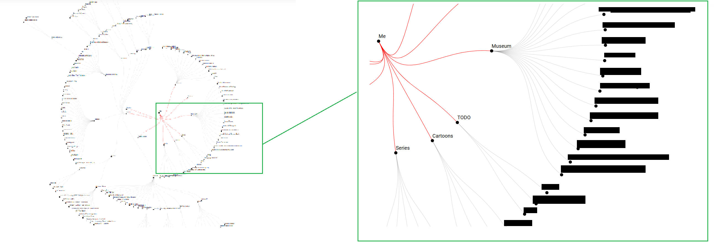
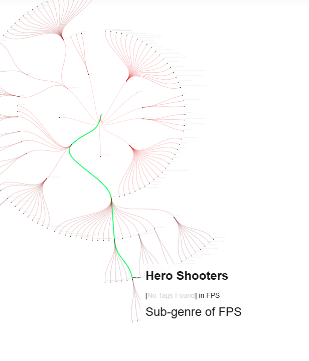
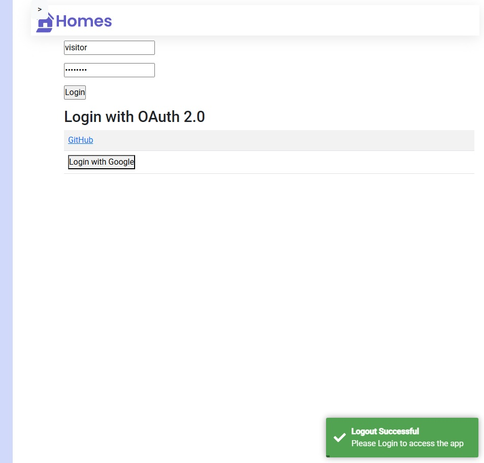
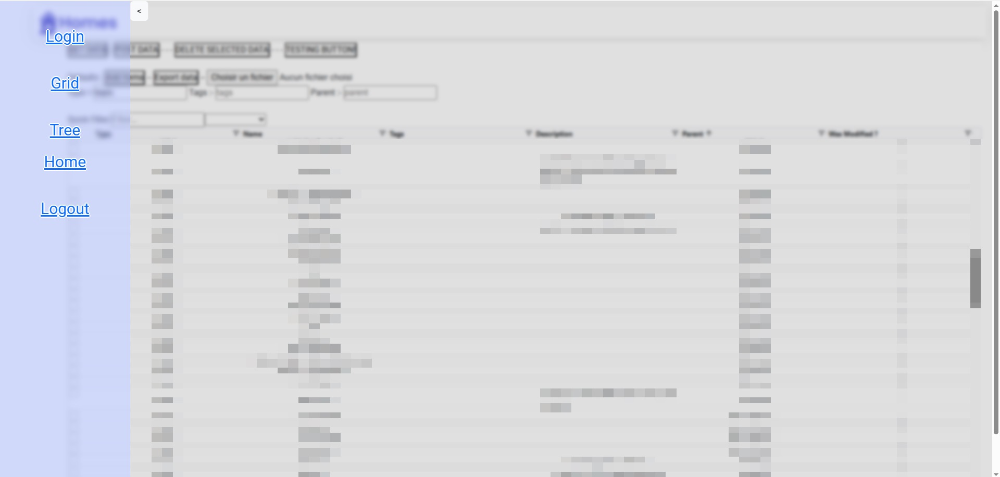
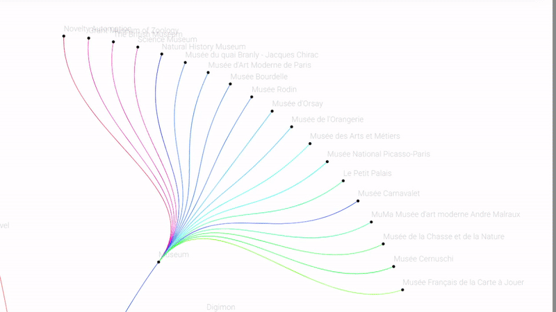

# Overlaytd

# This is an archive of old implementation 2025-09-28
# This branch is a backup of a version where I stored Data into NgRx-Store, it is overkill

User Interface for [Relaytd](https://github.com/Stickykenny/Relaytd)

## Preview

##### Radial Tree View

| Radial tree layout                                                                                                                                            | Node on mouse-over                                                                                                                         |
| ----------------------------------------------------------------------------------------------------------------------------------------------------- | ----------------------------------------------------------------------------------------------------------------------------------------- |
|  |  |

| Login page                                                                                                                                            | Navbar Animation                                                                                                                          |
| ----------------------------------------------------------------------------------------------------------------------------------------------------- | ----------------------------------------------------------------------------------------------------------------------------------------- |
|  |  |

##### Main editor tab - Grid

##### Shenanigans (unwanted features that appeared in development)

Raindow path with infinite loop

