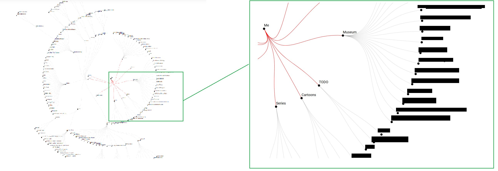
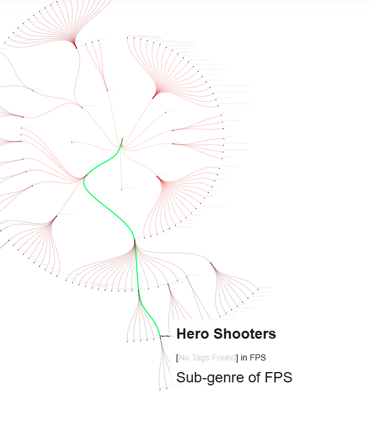
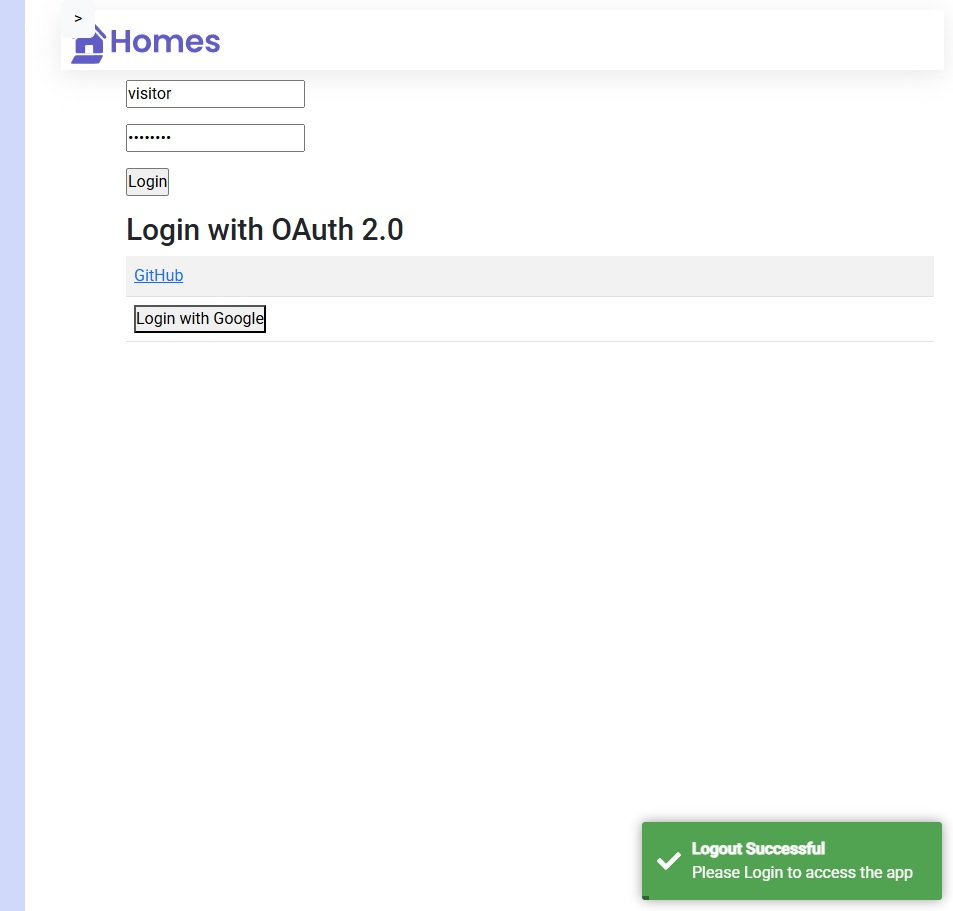
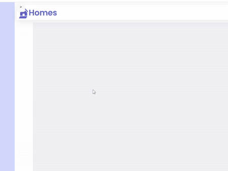
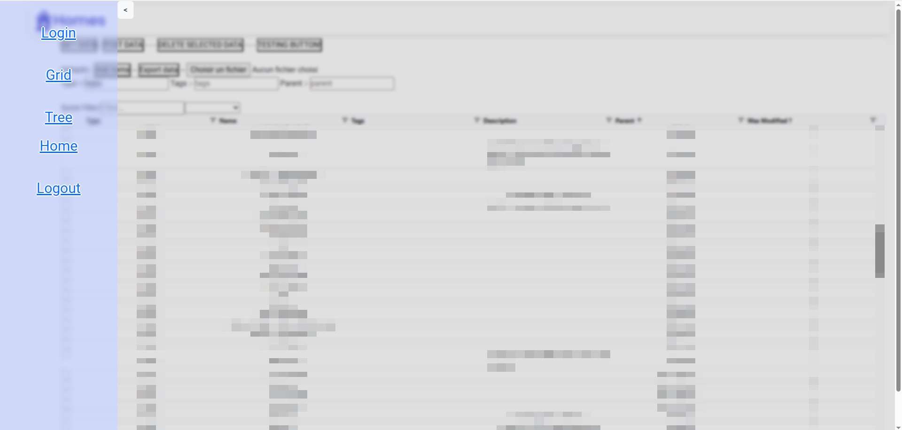
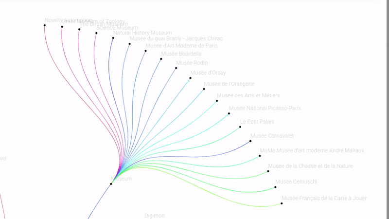

# [Overlaytd](https://stkykenny.github.io/Overlaytd/)

CHECK IT OUT HERE : [Overlaytd Preview](https://stkykenny.github.io/Overlaytd/)
User Interface for [Relaytd](https://github.com/Stkykenny/Relaytd)

## List of features implemented

<b>Global : </b>

- Left navigation sidebar
- Info dialog / page description top-right
- Notifications w/ ngx-toastr
- Floating windows / Media-dock for additional usage (Youtube playlist, and possibly RSS implementation)
- [PROD] Login page is blocked due to the lack of backend server, small wave animation of the warn text
- HttpInterceptorFn : Intercept call to API and retry in case of JWT expired
- Offline Database using IndexedDB/Dexie.js. **Currently only tested for logic with the Grid and display with the Tree**
- ~~NgRx-store : old implementation unused due to being too overcomplicated for current need~~

<b>Tree (D3.js) : </b>

- Radial tree
- Slider for tree rotation, coupled with Sfx pitch changes for cranking sounds (using Tone.js)
- Node on hover display a tooltip
- Tooltip gets pinned on click and display buttons for additional logics
- On node hover ancestry branch transition to rainbow

<b>Grid : </b>

- Add/Delete
- Quick Search in grid
- Import/Export data
- QoL (condition check, new row with default input)
- Confirmation dialog on import to allow overwrite/append/cancel

## Preview

##### Radial Tree View

| Radial tree layout                                                                                                                 | Node on mouse-over                                                                                                                                  |
| ---------------------------------------------------------------------------------------------------------------------------------- | --------------------------------------------------------------------------------------------------------------------------------------------------- |
|  |  |

| Login page                                                                                                                                            | Navbar Animation                                                                                                                          |
| ----------------------------------------------------------------------------------------------------------------------------------------------------- | ----------------------------------------------------------------------------------------------------------------------------------------- |
|  |  |

##### Main editor tab - Grid

##### Shenanigans (unwanted features that appeared in development)

Raindow path with infinite loop

